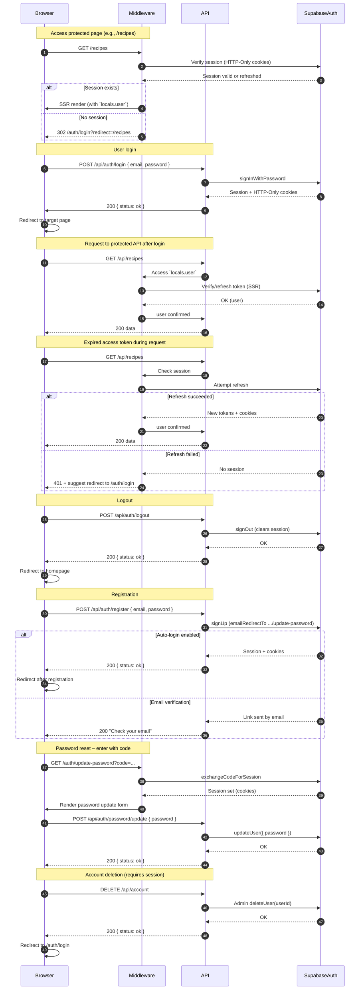

```mermaid
sequenceDiagram
autonumber
participant Browser
participant Middleware
participant API
participant SupabaseAuth

Note over Browser,Middleware: Access protected page (e.g., /recipes)
Browser->>Middleware: GET /recipes
Middleware->>SupabaseAuth: Verify session (HTTP‑Only cookies)
SupabaseAuth-->>Middleware: Session valid or refreshed
alt Session exists
  Middleware->>Browser: SSR render (with `locals.user`)
else No session
  Middleware-->>Browser: 302 /auth/login?redirect=/recipes
end

Note over Browser,API: User login
Browser->>API: POST /api/auth/login { email, password }
API->>SupabaseAuth: signInWithPassword
SupabaseAuth-->>API: Session + HTTP‑Only cookies
API->>Browser: 200 { status: ok }
Browser->>Browser: Redirect to target page

Note over Browser,API: Request to protected API after login
Browser->>API: GET /api/recipes
API->>Middleware: Access `locals.user`
Middleware->>SupabaseAuth: Verify/refresh token (SSR)
SupabaseAuth-->>Middleware: OK (user)
Middleware->>API: user confirmed
API-->>Browser: 200 data

Note over Browser,API: Expired access token during request
Browser->>API: GET /api/recipes
API->>Middleware: Check session
Middleware->>SupabaseAuth: Attempt refresh
alt Refresh succeeded
  SupabaseAuth-->>Middleware: New tokens + cookies
  Middleware->>API: user confirmed
  API-->>Browser: 200 data
else Refresh failed
  SupabaseAuth-->>Middleware: No session
  Middleware-->>Browser: 401 + suggest redirect to /auth/login
end

Note over Browser,API: Logout
Browser->>API: POST /api/auth/logout
API->>SupabaseAuth: signOut (clears session)
SupabaseAuth-->>API: OK
API-->>Browser: 200 { status: ok }
Browser->>Browser: Redirect to homepage

Note over Browser,API: Registration
Browser->>API: POST /api/auth/register { email, password }
API->>SupabaseAuth: signUp (emailRedirectTo .../update-password)
alt Auto-login enabled
  SupabaseAuth-->>API: Session + cookies
  API-->>Browser: 200 { status: ok }
  Browser->>Browser: Redirect after registration
else Email verification
  SupabaseAuth-->>API: Link sent by email
  API-->>Browser: 200 "Check your email"
end

Note over Browser,Middleware: Password reset – enter with code
Browser->>Middleware: GET /auth/update-password?code=...
Middleware->>SupabaseAuth: exchangeCodeForSession
SupabaseAuth-->>Middleware: Session set (cookies)
Middleware->>Browser: Render password update form
Browser->>API: POST /api/auth/password/update { password }
API->>SupabaseAuth: updateUser({ password })
SupabaseAuth-->>API: OK
API-->>Browser: 200 { status: ok }

Note over Browser,API: Account deletion (requires session)
Browser->>API: DELETE /api/account
API->>SupabaseAuth: Admin deleteUser(userId)
SupabaseAuth-->>API: OK
API-->>Browser: 200 { status: ok }
Browser->>Browser: Redirect to /auth/login
```
